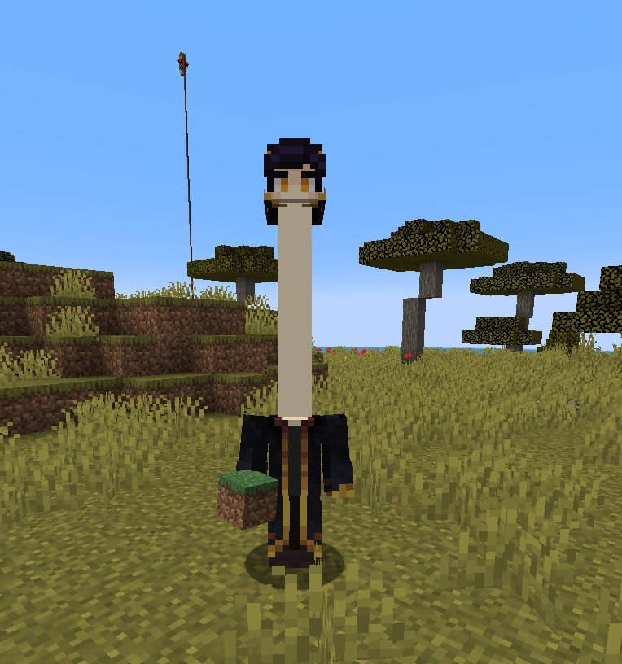
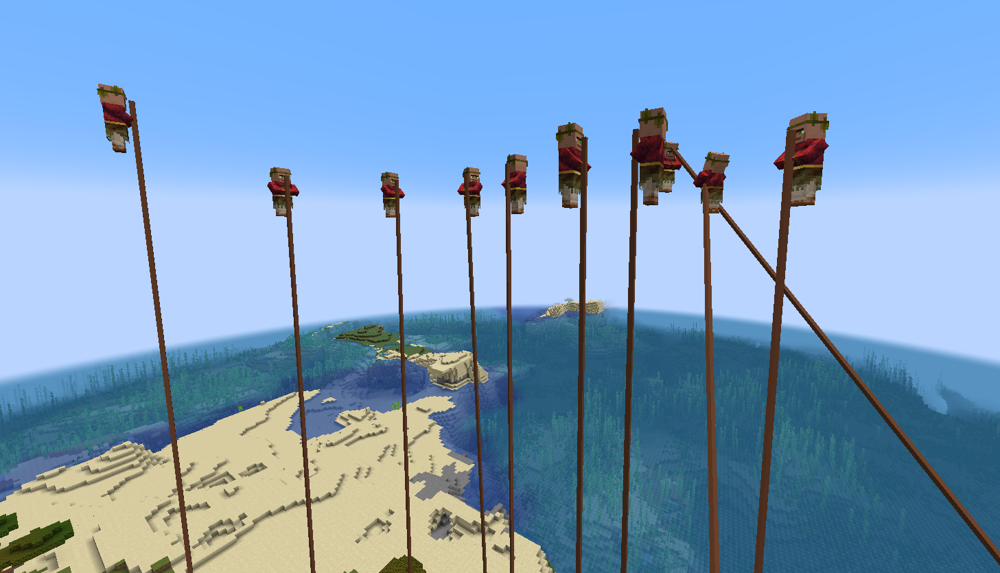
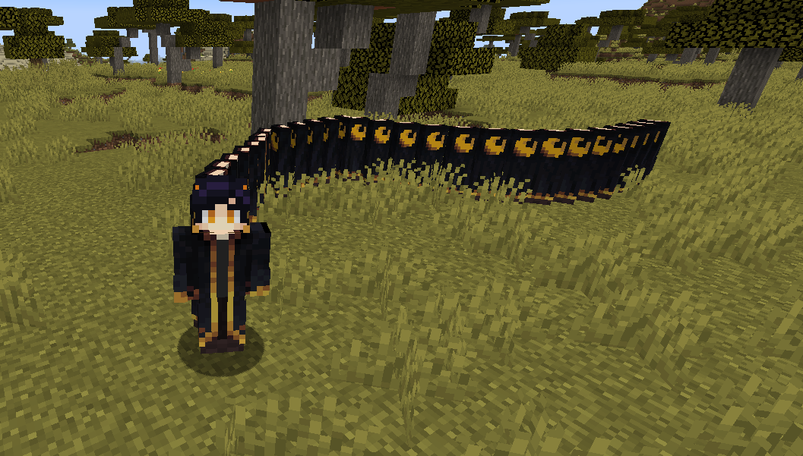

# EXPERIMENTAL GAMEPLAY SYSTEMS

Experimental Minecraft gameplay framework focused on dynamic player mutations, environmental interactions, entity manipulation systems, and physics-inspired gameplay mechanics.

---

## Overview

Experimental Gameplay Systems introduces a collection of unconventional gameplay mechanics designed to create unpredictable and highly interactive Minecraft experiences.

The project focuses on dynamic gameplay behavior, player state modifications, environmental reactions, and experimental interaction systems rather than traditional content expansion.

---

## Core Features

- Dynamic player mutation systems
- Environmental interaction mechanics
- Experimental entity behavior systems
- Physics-inspired gameplay effects
- Reactive world interaction events
- Custom gameplay transformation mechanics
- Multiplayer-friendly interaction systems

---

## Gameplay Systems

The project is designed around creating unusual and highly interactive gameplay scenarios through experimental mechanics and dynamic player/world interactions.

Included systems:
- Dynamic neck growth mechanics
- Player weight & movement systems
- Environmental reaction events
- Entity modification systems
- Interactive world behavior mechanics
- Physics-based gameplay interactions

---

## Technical Overview

- Modular gameplay architecture
- Dynamic player state handling
- Event-driven gameplay processing
- Client/server gameplay synchronization
- Custom entity interaction systems
- Optimized gameplay event management

---

## Preview

  

  

  

---

## Status

Active experimental gameplay project under continued development.
